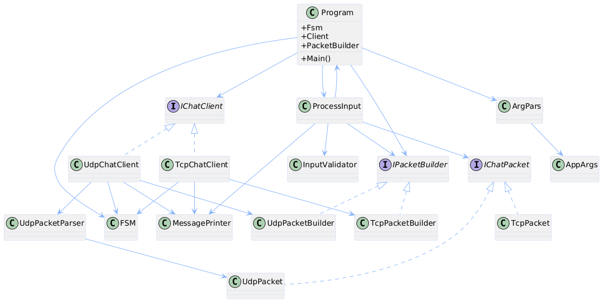
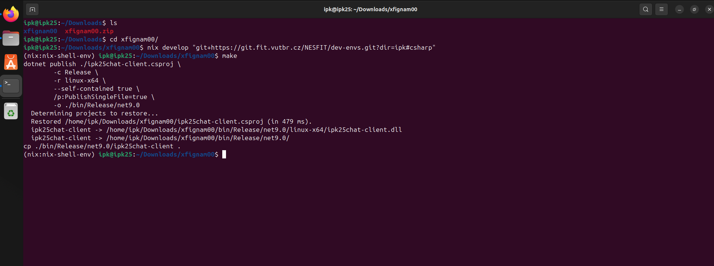
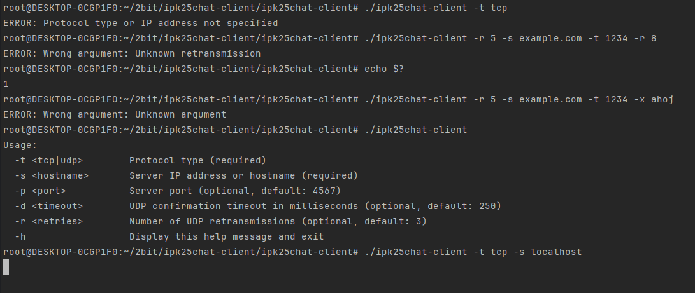
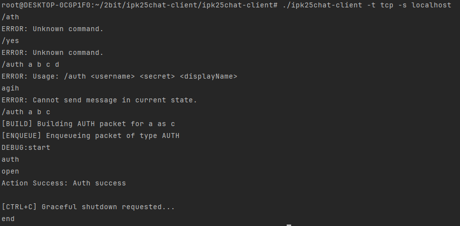
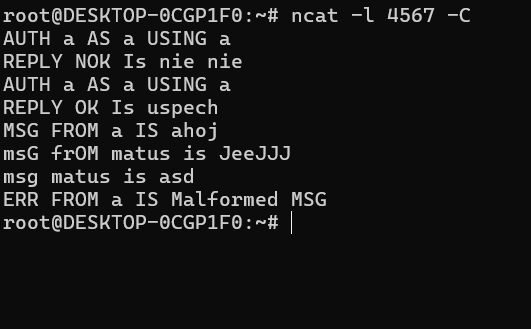
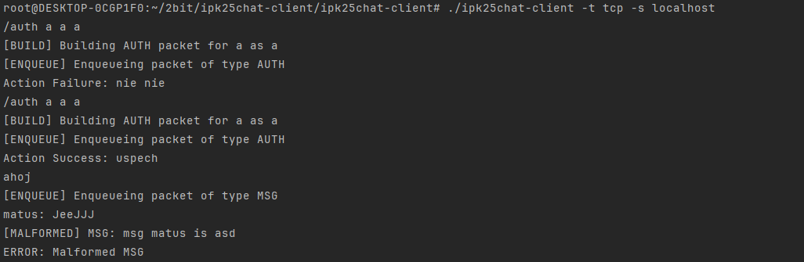
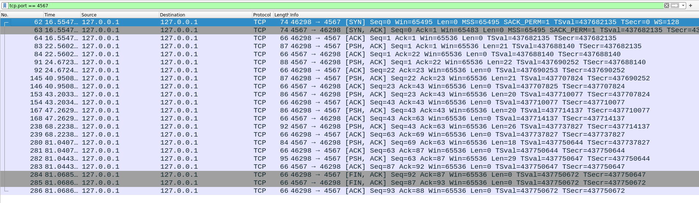
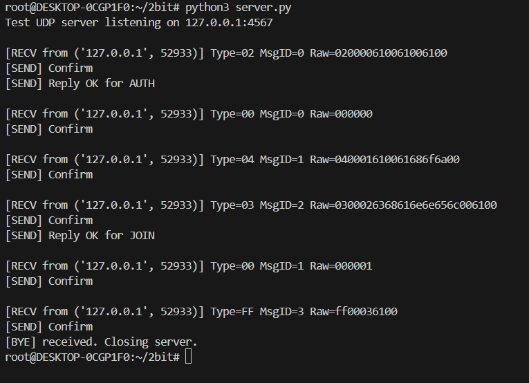
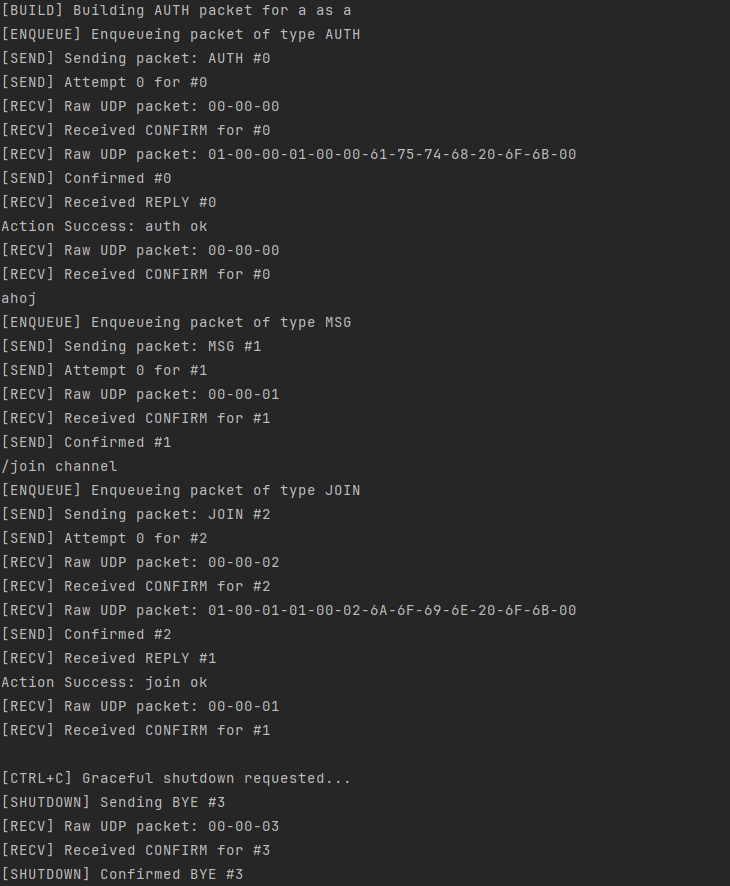
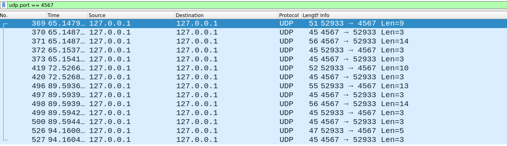

# Dokumentácia ku IPK2 projektu
Matúš Fignár - xfignam00 - 19.4.2025

## Obsah
- [Teoretický úvod](#teoretický-úvod)
  - [TCP](#tcp)
  - [UDP](#udp) 
- [Architektúra a popis programu](#architektúra-a-popis-programu)
- [Ukážka kódu](#ukážka-kódu)
- [Testovanie](#testovanie)
  - [Testovacie prostredie](#testovacie-prostredie)
  - [Nástroje testovania](#nástroje-testovania)
  - [Testovanie inputu](#testovanie-inputu)
  - [TCP Testovanie](#tcp-testovanie)
  - [UDP testovanie](#udp-testovanie)
- [Použitie AI pri práci na projekte](#použitie-ai-pri-práci-na-projekte)
- [Bibliografia](#bibliografia)

## Teoretický úvod
V prostredí komunikácie dvoch zariadení prostredníctvom internetu sa najčastejšie využívajú dva základné protokoly 
transportnej vrstvy: **TCP - Transmission Control Protocol** a **UDP - User Datagram Protocol**. Každý z týchto
protokolov má svoje výhody aj nevýhody a každý je vhodný pre iný typ aplikácií.
### TCP
**TCP** je protokol so spoľahlivým spojením (Connection-oriented), to znamená, že pred prenosom dát medzi oboma stranami
sa vytvorí stabilné spojenie. TCP zabezpečuje, že všetky odoslané dáta budú prijaté v rovnakom poradí, ako boli odoslané, 
a že v prípade straty alebo poškodenia niektorého segmentu dôjde k jeho automatickému opätovnému odoslaniu.
Spoľahlivosť je zabezpečená pomocou interných mechanizmov, ako je očíslovanie segmentov, 
potvrdenia prijatia (ACK), detekcia strát atď.
Tento protokol je vhodný hlavne pre aplikácie, ktoré si vyžadujú istotu spojenia napríklad WWW stránky, emaily, 
peer-to-peer file sharing.
Jednou z nevýhod tohto protokolu je, vyššia réžia, latencia, zložitejšie spracovanie, nevhodný pre broadcast alebo multicast.

### UDP
**UDP** je jednoduchý nespoľahlivý protokol transportnej vrstvy, ktorý neposkytuje záruku doručenia, poradia ani integrity.
Narozdiel od TCP je connectionless - nevyžaduje nadviazanie spojenia pred odoslaním dát to prináša rôzne nevýhody napríklad: 
stratené alebo poškodené packety sa neopravujú.
Kvôli nízkej réžii a pomerne vysokej rýchlosti sa tento protokol využíva najmä v aplikáciach kde je podstatnejšia latencia,
ako napríklad: streamovanie, online hry... .
UDP je jednoduchší na implementáciu ale kladie väčšie nároky na samotnú aplikáciu, ktorá musí zabezpečiť potvrdzovanie 
prijímania správ.


## Architektúra a popis programu
Po spustení a spracovaní vstupných argumentov (`ArgPars.cs`) sa na základe konfigurácie (uložená v `AppArgs.cs`)
zvolí príslušný chat klient. Pomocou metódy `Connect` sa klient spojí so serverom, ďalej prográm spúšťa
asynchrónne metódy `SendAsync` na posielanie správ na server, `RecieveAsync` metóda na získanie správ alebo packetov
zo servera a ich validáciu, `InputReader`, ktorý číta riadky zo vstupu a volá metódu `ProcessInputByUser`.

Proces od zadania správy na terminál až po prijatie na server vyzerá následovne. Užívateľ zadá príkaz, `ProcessInputByUser`
skontroluje prefix zadaného príkazu, zavolá metódu `IsCmdValidd` (z triedy `FSM.cs`), ktorá skontroluje, či 
správa môže byť v aktuálnom stave poslaná, ďalej zavolá metódy na validáciu syntaxe príkazu (`InputValidator` trieda)
a pri úspechu vytvorí `packet`, ktorý je následne odovzdaný aktívnemu klientovi `EnqueuePacket` (ktorý klient je aktívny sa zisťuje podľa `TryGetClient`).
`EnqueuePacket` pridá packet do `ConcurrentQueue`, ďalej overí či sa vyprázdnila `_sendQueueEmptyTcs` (ÁNO => RESET)
a signalizuje pomocou  `_sendSignal`, že sa packet môže odoslať.

`SendAsync` po uvoľnení semaforu vyberie packet z fronty (`TryDequeue`), skontroluje či je fronta prázdna
a (ak áno signalizuje to `_sendQueueEmptyTcs`) a pošle na server správu alebo packet pomocou `stream.WriteAsync`
následne zmení svoj stav `fsm.ChangeStateSend`. Pokiaľ odosielateľom je `UdpChatClient`, tak `SendAsync` sa zablokuje
a čaká na patričný `CONFIRM` (max `r + 1` krát). Pokiaľ je odoslanou správou `AUTH` alebo `JOIN`, klient očakáva
`REPLY` odpoveď. Keď nedostane `REPLY` po 5 sekundách, posiela `ERR` packet na server a ukončuje spojenie (podobné chovanie má aj `CONFIRM`)

`RecieveAsync` prijíma správy zo servera pomocou `stream.ReadAsync`. Pri `TCP` prenose môže klient
prijať dáta, ktoré obsahujú menej alebo viac ako jednu správu a to sa patrične spracuje (viz [Kód](#ukážka-kódu)). Potom
úplné správy sa vyhodnotia (`ProcessServerMessage`), a keď sú správne tak sa správa vypíše na `Stdout`, keď sú poškodené
alebo nesprávne, tak na `Stdout` sa vypíše errorová správa a na server sa posiela `ERR` a program končí. `UDP` klient to robí 
podobne ako `TCP` iba s tým rozdielom, že on spracuje packet hneď po prijatí (`Parse` v `UdpPacketParser`). Pokiaľ packet
je typu `CONFIRM`, ktorý nebol spracovaný, informuje sa `SendAsync` inak sa ignoruje. Následne sa skontroluje či správa
mohla byť prijatá v súčasnom stave. Pokiaľ nie tak sa vypíše error a posiela sa `ERR` na server. Keď `UDP` prijeme
`BYE` zo servera, pošle `CONFIRM` na server, čaká krátku dobu pre prípadnú retranzmisiu zo servera a podľa situáciu ukončuje spojenie.


|    *Zjednodušený Diagram Tried*     |
|:-----------------------------------:|
|  |


## Ukážka kódu
```csharp
  messageBuffer += Encoding.ASCII.GetString(buffer, 0, read);
  // if not whole message was recieved, don't evaluate but continue
  if (!messageBuffer.Contains("\r\n"))
        continue;
            
  // more than one message can be sent in one packet
  string[] splitMessages = messageBuffer.Split("\r\n", StringSplitOptions.None);
            
  // if packet contains not full message add it to the buffer
  if (!messageBuffer.EndsWith("\r\n"))
  {
        messageBuffer = splitMessages[^1];
        splitMessages = splitMessages[..^1];
  }
  else
  {
        messageBuffer = "";
  }
            
```
Prijatie správy zo servera a jej následné rozkúskovanie na úplné správy (`TcpChatClient`).

## Testovanie
### Testovacie prostredie
- **Operačný systém**: WSL2 Ubuntu 22 + (Nix prostredie)
- **.NET Verzia**: 9
- **Network Interface**: Ethernet (eth0), Tunnel (tun0), Local (lo)
- **Zariadenie**: Lenovo Legion Slim 5

### Nástroje testovania
Na testovanie tejto implementácie boli využité rôzne nástroje napríklad `Wireshark` aplikácia,
na zachytávanie a analýzu prenášaných paketov, aplikácia `netcat` na vytvorenie jednoduchej `TCP` komunikácie
medzi klientom a serverom, na `UDP` komunikáciu bol použitý `python` skript, ktorý vytvoril "dummy" server, 
ktorý vedel iba patrične odpovedať na zadané správy. V posledných fázach projektu bol použitý referenčný IPK server `anton5.fit.vutbr.cz:4567`.
Mimo môjho natívneho prostredia, program som skúšal testovať aj na virtuálnom stroji `ipk25` s prostredím `nix`, kde kompilácia a 
testy prebehli bez problémov.
Všetky chyby, ktoré boli odhalené pri testovaní boli aj patrične opravené podľa referenčných výsledkov.

|        *Úspešná kompilácia na VM*        |
|:----------------------------------------:|
|  |


### Testovanie inputu
V úvodných fázach vývoja bolo nutné správne otestovať rôzne kombinácia validných aj invalidných vstupov
pri spúšťaní programu ale aj pri zadávaní správ pre komunikáciu.
Boli testované situácie, ako napríklad:
- Nezadanie povinných argumentov
- Zadanie nepodporovaných argumentov
- Zadanie vstupných správ v invalidnom stave
- Zadanie syntakticky nesprávnych správ
- Zadanie správnych správ

  | Test argumentov                    | Test uživateľského vstupu             |
  | :--------------------------------: | :----------------------------------:  |
  |   |  |


### TCP Testovanie
Počas testovania komunikácie prostredníctvom `TCP` klienta bolo testované:
- Správna komunikácia so serverom
- Ukončenie programu pri neprijatej `REPLY` správe
- Case insensitivity prijatých správ zo servera
- správne odosielanie `BYE` a následné ukončenie programu
- Ukončenie programu prostredníctvom `FIN` a nie `RST`
- Spracovanie invalidných správ od servera
- Prijatie a spracovanie `ERR` správy od servera

  |           Terminál ncat servera            |             Terminál užívateľa             |
  |:------------------------------------------:|:------------------------------------------:|
  |  |  |

 |                     Wireshark                      |
 |:--------------------------------------------------:|
 |  |

Na obrázku je možné vidieť správne vytvorenie `TCP` spojenia (`3-way handshake`), taktiež
správnu výmenu dátových packetov. Každý poslaný príkaz klientom je potvtrdený zo strany servera (`PSH`
a `ACK`) a nakoniec je možné vidieť, že klient ukočnuje komunikáciu poslaním `FIN`.

### UDP testovanie
Počas testovania komunikácie prostredníctvom `UDP` klienta bolo testované:
- Správna komunikácia so serverom
- Maximálny počet retransmisií
- Prijatie `BYE` packetu a odpojenie až po počkaní
- Spracovanie duplicitných `CONFIRM` packetov
- Spracovanie invalidných packetov od servera
- Správne nastavenie `endpoint` po autentifikaćii

  |          Terminál dummmy servera           |             Terminál užívateľa             |
  |:------------------------------------------:|:------------------------------------------:|
  |  |  |

|                     Wireshark                      |
|:--------------------------------------------------:|
|  |

Na obrázkoch je možné vidieť správnu výmenu `UDP` packetov medzi klientom a serverom.
Na základe výpisov aj Wireshark analýzy je vidieť, že komunikácia prebieha podľa očakávanej špecifikácie.


## Použitie AI pri práci na projekte
AI, presnejšie ChatGPT, bolo v tomto projekte využité na stanovenie cieľov postupu implementácie, 
občasnú kontrolu a pomoc pri refaktorizácii jednotlivých častí projektu. AI výrazne zasiahlo do kódu,
keď nahradilo ukončovanie programu s použitím aktívneho čakania (`Task.Delay`), asynchrónnym riešením pomocou
`TaskCompletionSource` a `CancellationToken`.


## Bibliografia
1. [RFC5234] Crocker, D. and Overell, P. Augmented BNF for Syntax Specifications: ABNF [online]. January 2008. [cited 2024-02-11]. DOI: 10.17487/RFC5234. Available at: https://datatracker.ietf.org/doc/html/rfc5234
2.  User Datagram Protocol - Wikipedia - Available at: https://en.wikipedia.org/wiki/User_Datagram_Protocol#Attributes.
3. Transmission Control Protocol - Wikipedia - Available at: https://en.wikipedia.org/wiki/Transmission_Control_Protocol
4. System.Net.Sockets.TcpClient - Microsoft - Available at: https://learn.microsoft.com/en-us/dotnet/api/system.net.sockets.tcpclient?view=net-9.0
5. System.Net.Sockets.UdpClient - Microsoft - Available at: https://learn.microsoft.com/en-us/dotnet/api/system.net.sockets.udpclient?view=net-9.0


