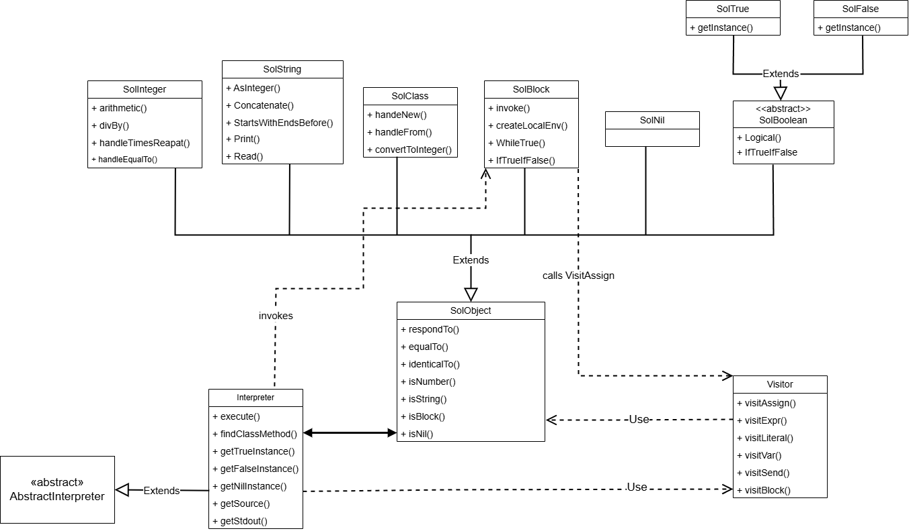

Implementační dokumentace k 2. úloze do IPP 2024/2025  
Jméno a příjmení: Matúš Fignár  
Login: xfignam00

# Úvod

Toto je implementácia druhého projektu predmetu IPP. Cieľom tohto projektu je interpretovať objektovo orientovaný jazyk SOL25. Riešenie je implementované v jazyku `PHP 8.4`. Na interpretáciu sa využíva objektovo orientovaný návrh, ktorý je kompatibilný s zadaným rámcom `ipp-core`.

# Architektúra
Architektúra tohto programu sa dá rozdeliť na tieto časti: `Objekty`, `Interpreter` a `Visitor`.

## Interpreter
Jadrom celého riešenia je trieda `Interpreter`, ktorá dedí z `AbstractInterpreter`. Táto trieda implementuje `classTable` zoznam, do ktorého sú vložené všetky vbudované triedy SOL25 s ich metódami a taktiež užívateľom zadané triedy a metódy pomocou metódy `buildClassTable` ktorá ich vyhľadá v `XML` strome. Celá interpretácia programu je volaná metodou `execute`. `Interpreter` taktiež obsahuje ďalšie pomocné metódy napríklad na vyhľadanie selectorov v zozname `classTable` a globlálne inštancie singletonov `True`, `False` a `Nil`. Zo zadaného rámca `ipp-core` využíva `SourceReader`, `InputReader` a `OutputWriter`.

## Visitor
Interpretácia výrazov a priradení je delegovaná pomocou triedy `Visitor`, ktorá implementuje takzvaný `visitor pattern`. Každý uzol AST má zodpovednú vlastnú metódu, ktorá zabezpečí jeho plné spracovanie.

## Objekty
Všetky hodnoty, výrazy aj bloky kódu sú reprezentované ako inštancie tried, ktoré implementujú spoločné rozhranie správania pomocou bázovej triedy `SolObject`. Všetky objekty sú uložené vo vlastných súboroch. 

### SolObject
Predstavuje základ všetkých objektov v SOL25. Obsahuje meno triedy, inštančné polia (`fields`) a referenciu na `Interpreter`. Implementuje metódu `respondTo()`, ktorá zabezpečuje dynmaické vyhodnotenie selektorov. Táto metóda umožňuje dynamické odosielanie správ a rozhoduje, či sa jedná o metódu definovanú používateľom, vstavanú metódu alebo fallback.

### SolInteger
Reprezentuje celé čísla a implementuje aritmetické operácie, porovnanie a opakovane volanie bloku.
### SolString
Reprezentuje textové reťazce a implementuje operácie ako porovnanie 2 stringov, zreťazenie, orezanie textového reťazca, konverziu na číslo.
### SolBoolean
Abstraktná trieda pre hodnoty `true` a `false`, implementuje logické operácie, negáciu a vetvenie pre `ifTrue:ifFalse:`. 
### SolNil
Reprezentuje prázdnu hodnotu.
### SolBlock
Reprezentuje anonymné funkcie (bloky). Obsahuje zachytené prostredie a uzol AST reprezentujúci telo bloku. Metóda `invoke` umožňuje vyhodnotenie bloku s parametrami. `SolBlock` zároveň spracováva selektory ako `value`, `whileTrue:`, `ifTrue:ifFalse:` a overuje počet argumentov.
### SolClass
Táto trieda slúži na reprezentáciu metaobjektu triedy, a umožňuje vytváranie inštancií pomocou `new`, alebo konverziu hodnôt cez `from:`. Spracovanie sa vykonáva v závislosti od názvu triedy, ktorý je uložený vo vnútri objektu.

# Návrhový vzor
V tejto implementácii sú použité tieto návrhové vzory:
## Visitor pattern
Trieda `Visitor` implementuje spracovanie AST stromu pomocou metód ako `visitExpr`, `visitAssign`, `visitBlock` atď. Každý typ uzla v AST má vlastnú metódu, čím sa oddelí logika spracovania od samotnej štruktúry AST.
## singletonov
Triedy ako `SolTrue`, `SolFalse` a `SolNil` sú implementované ako singletony pomocou statickej metódy `getInstance`, ktorá zabezpečuje, že počas behu programu existuje iba jedna inštancia týchto objektov. Singletony sú inicializované v triede Interpreter a sú prístupné v globálnom prostredí počas celej interpretácie.

# Spracovanie chybových stavov
Počas interpretácie môže dôjsť k rôznym chybovým stavom, ktoré sú ošetrené podľa špecifikácie. Program v takýchto prípadoch končí s príslušným návratovým kódom. Tieto kódy sú vracané pomocou výnimiek a ich spracovanie je centralizované v hlavnej metóde `execute`.

# Nedostatky implementácie
- Nepodporovanie špeciálnej premennej `super` umožňujúcu volania metód nadradenej triedy 
- Neúplné dedenie atribútov a správania
- Obmedzenie na bloky s najviac 2 parametrami
- Slabé pokrytie konverzii pri `from:`

# UML Diagram
